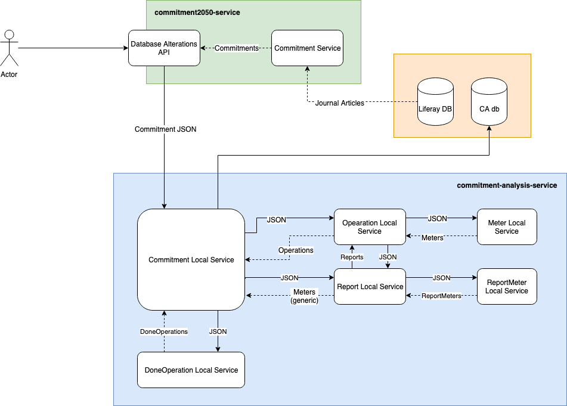
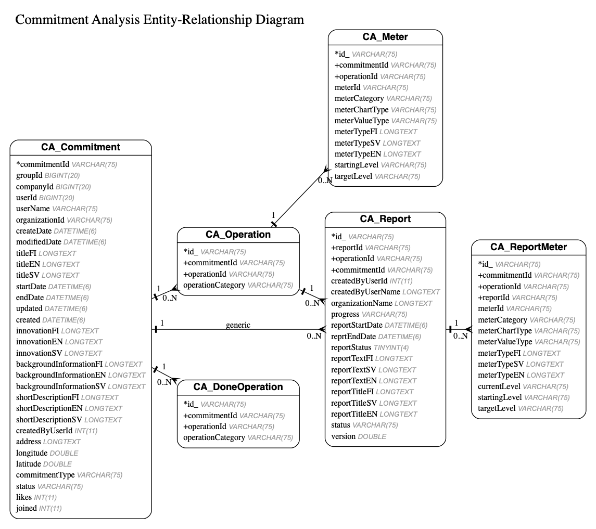

# Commitment Analysis

This service / API is used to analyse commitment related data.

This whole module was generated with [Liferay ServiceBuilder](https://portal.liferay.dev/docs/7-0/tutorials/-/knowledge_base/t/service-builder).

## Approximate implementation and usage



## Build and deploy

Use gradle for all commands. These can be executed from the module root `commitment-analysis` or from within `commitment-analysis-service`.

### Build service

The gradle task `buildService` generates abstract classes and interfaces. 
Basically the whole `commitment-analysis-service` is generated if it does not exist.

```bash
blade gw buildService
```

### Deploy

The `deploy` task will deploy the module to OSGi. 
Remember to build the service and [create the database](#creation) before doing this if you have made changes.

```bash
blade gw deploy
```

### Clean ServiceBuilder

**NOTE: This will terminate and uninstall any running OSGi instances of this module!**

**Do not run this unless you really mean to wipe the service.**

```bash
blade gw cleanServiceBuilder
```

## Database

### Tables

The module creates the following tables.



### Creation

he Service Builder can not create tables automatically, as this service uses a custom schema `ca`.
Instead you have to create the schema and all the tables by your self. Any future DB changes will have to be manually migrated.

In the module root there is an SQL file containing all schema and table creation scripts: [`create_ca_db.sql`](./create_ca_db.sql).

If you make any changes to the models that require changes in the DB, please also update the previously mentioned `create_ca_db.sql` file.

## API

Nothing yet

## Examples

**TODO: Update according to new calculations and data**

### Average user commitment values

Calculates the **individual** user's commitment reduction percentages and CO2 kg.

```sql
SELECT SUM(targetLevel)                                        as sumPercent,
       COUNT(targetLevel)                                      as totalMeters,
       SUM(targetLevel) / COUNT(DISTINCT commitmentId)         as averageReductionPercentage,
       COUNT(DISTINCT commitmentId)                            as commitments,
       10300                                                   as averageFootprintKg,
       10300 * COUNT(DISTINCT commitmentId) *
       (SUM(targetLevel) / COUNT(DISTINCT commitmentId) / 100) as totalReductionKg
FROM CA_Meter
WHERE meterId IN (
    SELECT numericMeters.id
    FROM (SELECT CAST(meters.meterId as unsigned) as id
          FROM (SELECT DISTINCT meterId
                FROM CA_Meter
                WHERE meterValueType = 'NUMBER'
                  AND meterChartType = 'LINE'
                  AND startingLevel = 0
                  AND commitmentId IN (
                    SELECT DISTINCT commitmentId
                    FROM CA_Commitment
                    WHERE commitmentType = 'COMMITMENT'
                      AND status = 'approved'
                      AND innovationFI IS NULL
                      AND innovationEN IS NULL
                      AND innovationSV IS NULL
                      AND (titleFI LIKE 'Tavoitteeni on%' OR titleEN LIKE 'My commitment is%')
                )) as meters) AS numericMeters
    WHERE numericMeters.id > 10000
);
```

Results in a table like this:

| sumPercent         | totalMeters | averageReductionPercentage | commitments | averageFootprintKg | totalReductionKg  |
|:------------------:|:-----------:|:--------------------------:|:-----------:|:------------------:|:-----------------:|
| 42623.799999998024 | 30361       | 33.56204724409293          | 1270        | 10300              | 4390251.399999796 |

### Get reductions by meter

Calculates the average reduction percentage and total reduced kg per Meter.

```sql
SELECT meterTypeFI,
       COUNT(DISTINCT commitmentId)                            as commitments,
       SUM(targetLevel) / COUNT(DISTINCT commitmentId)         as averageReductionPercentage,
       10300 * COUNT(DISTINCT commitmentId) *
       (SUM(targetLevel) / COUNT(DISTINCT commitmentId) / 100) as totalReductionKg
FROM CA_Meter
WHERE meterId IN (
    SELECT numericMeters.id
    FROM (SELECT CAST(meters.meterId as unsigned) as id
          FROM (SELECT DISTINCT meterId
                FROM CA_Meter
                WHERE meterValueType = 'NUMBER'
                  AND meterChartType = 'LINE'
                  AND startingLevel = 0
                  AND commitmentId IN (
                    SELECT DISTINCT commitmentId
                    FROM CA_Commitment
                    WHERE commitmentType = 'COMMITMENT'
                      AND status = 'approved'
                      AND innovationFI IS NULL
                      AND innovationEN IS NULL
                      AND innovationSV IS NULL
                      AND (titleFI LIKE 'Tavoitteeni on%' OR titleEN LIKE 'My commitment is%')
                )) as meters) AS numericMeters
    WHERE numericMeters.id > 10000
) GROUP BY meterId;
```
